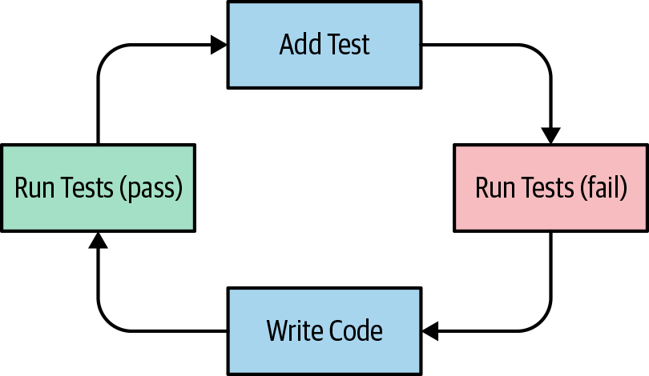
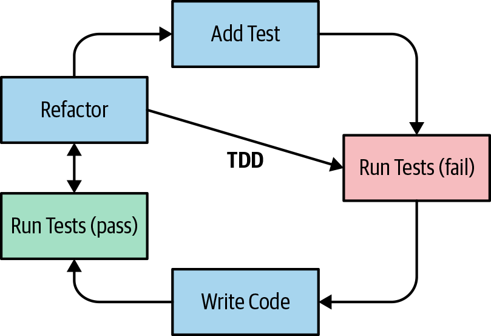

## Test Driven Development

For the business rules engine, the basic features you will need your users to undertake are:

- Add an action
- Run the action
- Basic reporting

This translates in basic API shown below:

```java
public class BusinessRulesEngine {
    // An action is simply a piece of code that will be executed
    // The Action interface will allow the business rule engine to be decoupled from concrete actions
    public void addAction(final Action action) {
        throw new UnsupportedOperationException();
    }

    public int count() {
        throw new UnsupportedOperationException();
    }

    public void run() {
        throw new UnsupportedOperationException();
    }
}
```

And the definition of `Action` interface

```java
@FunctionalInterface
interface Action {
    void execute();
}
```

The TDD philosophy is to start writing some tests that are going to let you guide the implementation of the code.

### Why Use TDD?

There are several benefits:

- Writing a test at a time will help you focus and refine the requirements by correctly implementing *one thing at a time*
- It's a way to ensure *a relevant organization for your code*. For example, by writing a test first, you need to think hard about the public interfaces for your code
- You are *building a comprehensive test suite* as you iterate through the requirements, which increases the confidence that you are matching the requirements and also reduces the scope of bugs
- You don't write code that you don't need because you are just writing code that passes the tests

### The TDD Cycle



1. Write a test that fails
2. Run all tests
3. Make the implementation work
4. Run all tests

In practice, as part of this process, you must continuously refactor your code or it will end up unmaintainable. Which leads to below process



Our first tests to verify that `addActions` and `count` behave correctly:

```java
public class BusinessRuleEngineTest {
    @Test
    public void shouldHaveNoRulesInitially() {
        final BusinessRulesEngine businessRulesEngine = new BusinessRulesEngine();
        assertEquals(0, businessRulesEngine.count());
    }
    
    @Test
    public void shouldAddTwoActions() {
        final BusinessRulesEngine businessRulesEngine = new BusinessRulesEngine();
        businessRulesEngine.addAction(() -> {});
        businessRulesEngine.addAction(() -> {});
        assertEquals(2, businessRulesEngine.count());
    }
}
```

All tests are failing, but that’s fine. It gives us a reproducible test suite that will guide the implementation of the code. Now can add some implementation code and rerun the tests. (`Chapter05.List02`)

However, there is one crucial operation missing. How do we write a test for the method run? Unfortunately, `run()` does not return any result. We are going to need a new technique called mocking to verify that the method `run()` operates correctly.

## Adding Conditions

### Modeling state

The users of the business rules engine will need to execute actions based on certain conditions. You may start by writing code that adds an action and refers to a local variable using a lambda expression.

```java
final Customer customer = new Customer("Mark", "CEO");

businessRuleEngine.addAction(() -> {
  if ("CEO".equals(customer.getJobTitle())) {  // Here is the condition we want to test
    Mailer.sendEmail("sales@company.com", "Relevant customer: " + customer);
  }
})
```

This approach is inconvenient for several reasons:

1. How do you test the action? It's not an independent piece of functionality: it has a hardcoded dependency on the customer object
2. The customer object is not grouped with the action. It is a sort of external state that is shared around, leading to a confusing mix of responsibilities

We need to encapsulate the state that is available to actions within the Business Rules Engine. We introduce a new class called `Facts`, which will represent the state available as part of the Business Rules Engine, and an updated `Action` interface that can operate on facts. This `Facts` class will decouple `Action` from `Customer` like this:

```java
businessRuleEngine.addAction(facts -> {
  final String jobTitle = factos.getFact("jobTitle");
  if ("CEO".equals(jobTitle)) {
    final String name = facts.getFact("name");
    Mailer.sendEmail("sales@company.com", "Relevant customer: " + name);
  }
})
```

### Interface Segregation Principle

No class should be forced to depend on methods it does not use because this introduces unnecessary coupling. The ISP focuses on the user of an interface rather than its design. In other words, if an interface ends up very large, it may be that the user of that interface sees some behaviors it doesn’t care for, which causes unnecessary coupling.
